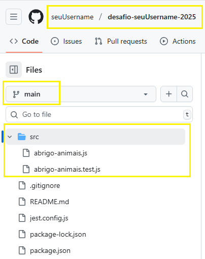

# Sistema de Adoção de Animais - AbrigoAnimais

Este projeto implementa um sistema de adoção de animais para um abrigo, onde duas pessoas competem para adotar animais com base em seus brinquedos favoritos e outras regras específicas.

## Objetivo do Projeto

Este projeto foi desenvolvido como parte de um desafio técnico para uma vaga, demonstrando habilidades em JavaScript, design de software, implementação de lógica de negócios complexa e práticas de teste abrangentes.

## Como Configurar e Executar

Para configurar e executar o projeto localmente, siga os passos abaixo:

1.  **Clone o repositório** (se aplicável, ou use o projeto existente).
2.  **Instale as dependências:**

    ```bash
    npm install
    ```

3.  **Execute os testes (opcional, mas recomendado):**

    ```bash
    npm test
    ```

## ENTREGANDO O DESAFIO
Após resolver o desafio e validá-lo com os testes, você terá que criar um repositório **público** no [Github](https://github.com/) com o **nome** de `desafio-seuUsername-2025` (substitua "seuUsername" pelo seu usuário do GitHub) e colocar o código na **branch** `main`.

Se você ainda não teve contato com essa ferramenta, não tem problema. Separamos um material para lhe ajudar nessa etapa: [Como usar Git e Github na prática](https://www.youtube.com/watch?v=UBAX-13g8OM).

## VALIDANDO A ENTREGA
Para garantir que seu desafio vai ser considerado entregue, revise os seguintes pontos:

#### GIT
O repositório deve ser **público** e ter o **nome** e **branch** indicados na seção `ENTREGANDO O DESAFIO`.

Para verificar que o repositório é público, deslogue-se do github e tente ver o código. Se conseguir, nós também conseguimos! Lembrando que vamos usar o link para o usuário informado durante o cadastro na Gupy. Veja [como alterar a visibilidade](https://docs.github.com/pt/repositories/managing-your-repositorys-settings-and-features/managing-repository-settings/setting-repository-visibility#changing-a-repositorys-visibility).

#### CÓDIGO
A solução deve ser entregue em **javascript** e a **estrutura de pastas e arquivos** deve seguir o indicado na seção `O CÓDIGO`.

O **export** da classe deve ser mantido da seguinte maneira para compatibilidade com o arquivo de testes:
```js
export { AbrigoAnimais as AbrigoAnimais };
```

Se todos os passos forem seguidos corretamente, você terá um repositório como o da figura abaixo (lembrando que é permitido criar mais arquivos), onde `seuUsername` é o seu usuário do GitHub, que você informou no questionário da Gupy.



## Design e Qualidade da Solução

A solução foi projetada com foco em modularidade, legibilidade e manutenibilidade. A lógica foi dividida em métodos auxiliares (`validarEntradas`, `checkAnimalToyElegibility`, `processarAdocoes`, `formatarSaida`) para garantir que cada parte do código tenha uma responsabilidade clara.

### Cobertura de Testes

O projeto inclui uma suíte de testes abrangente (`src/abrigo-animais.test.js`) que valida todas as regras de negócio e cenários de erro, garantindo a robustez e a correção da implementação. Foi alcançada **100% de cobertura de código**, o que atesta a confiabilidade da solução.

## Descrição da Classe `AbrigoAnimais`

A classe `AbrigoAnimais` contém a lógica principal para processar as solicitações de adoção.

### Método `encontraPessoas(brinquedosPessoa1, brinquedosPessoa2, ordemAnimais)`

Este método é a interface principal para determinar quem adota quais animais. Ele recebe três parâmetros de texto, cada um com itens separados por vírgula.

*   `brinquedosPessoa1`: Uma string de brinquedos que a Pessoa 1 possui, separados por vírgula (ex: `'RATO,BOLA,LASER'`).
*   `brinquedosPessoa2`: Uma string de brinquedos que a Pessoa 2 possui, separados por vírgula (ex: `'CAIXA,NOVELO'`).
*   `ordemAnimais`: Uma string com os nomes dos animais na ordem em que devem ser considerados para adoção, separados por vírgula (ex: `'Rexcão,Mimigato,Bolacão'`).

### Regras de Adoção

1.  **Ordem dos Brinquedos (Subsequência):** O animal vai para a pessoa que apresentar todos os brinquedos favoritos do animal na ordem desejada. Brinquedos adicionais podem ser intercalados.
2.  **Gatos:** Gatos exigem uma correspondência exata dos brinquedos (todos os brinquedos favoritos e na ordem exata, sem brinquedos extras).
3.  **Locojabuti:** Se houver mais de um animal sendo considerado, `Locojabuti` não se importa com a ordem dos brinquedos, apenas que a pessoa possua todos os seus brinquedos favoritos.
4.  **Limite de Adoções:** Uma pessoa não pode adotar mais de três animais.
5.  **Empate:** Se ambas as pessoas atenderem às condições de adoção para um animal, o animal permanece no abrigo.

### Saída do Programa

O método `encontraPessoas` retorna um objeto com uma lista de resultados ou uma mensagem de erro.

*   **Sucesso:**

    ```javascript
    { 
      lista: [
        "nome animal 1 - pessoa 1",
        "nome animal 2 - pessoa 2",
        "nome animal 3 - abrigo"
      ]
    }
    ```
    A lista de animais é retornada em ordem alfabética.

*   **Erro:**

    ```javascript
    { 
      lista: [], 
      erro: "Mensagem de erro apropriada"
    }
    ```
    As mensagens de erro incluem detalhes sobre animais inválidos/duplicados ou brinquedos inválidos/duplicados.

## Exemplo de Uso

```javascript
import { AbrigoAnimais } from './src/abrigo-animais.js';

const abrigo = new AbrigoAnimais();

// Exemplo de sucesso
const resultado1 = abrigo.encontraPessoas(
  'RATO,BOLA,LASER', 
  'CAIXA,NOVELO', 
  'Rexcão,Mimigato,Bolacão,Bebecão'
);
console.log('Resultado 1:', resultado1);
// Expected output: { lista: [ 'Bebecão - pessoa 1', 'Bolacão - pessoa 2', 'Mimigato - pessoa 1', 'Rexcão - pessoa 1' ] }

// Exemplo com erro: animal inválido
const resultado2 = abrigo.encontraPessoas(
  'RATO,BOLA', 
  'CAIXA', 
  'Lulu'
);
console.log('Resultado 2:', resultado2);
// Expected output: { lista: [], erro: 'Animais inválidos: Lulu' }

// Exemplo com limite de adoção (Pessoa 1 adota 3, os outros vão para o abrigo)
const resultado3 = abrigo.encontraPessoas(
  'LASER,RATO,BOLA,CAIXA,NOVELO', 
  '', 
  'Rexcão,Bolacão,Bebecão,Rexcão_extra,Bolacão_extra'
);
console.log('Resultado 3:', resultado3);
// Expected output: 
// {
//   lista: [
//     'Bebecão - pessoa 1',
//     'Bolacão - pessoa 1',
//     'Bolacão_extra - abrigo',
//     'Rexcão - pessoa 1',
//     'Rexcão_extra - abrigo'
//   ]
// }
```
